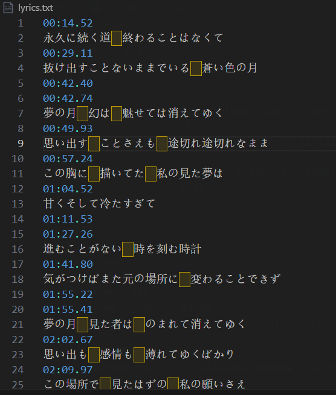
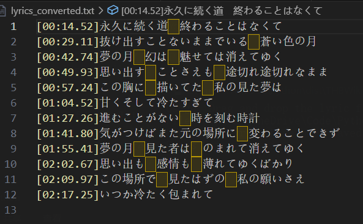

Convert lyric.txt from THBWiki to mp3 support lyric format

You can put the generated lrc file in the same directory as the music file, or embed the txt content into the mp3 file.

THBWiki website: https://thwiki.cc/

# Input and Output format





use this in command line to convert the python file to executable file:

```shell
pyinstaller --onefile THBWikiLyricConvert.py
```
I have been finished this step, so you can download dish/THBWikiLyricConvert.ext to use
